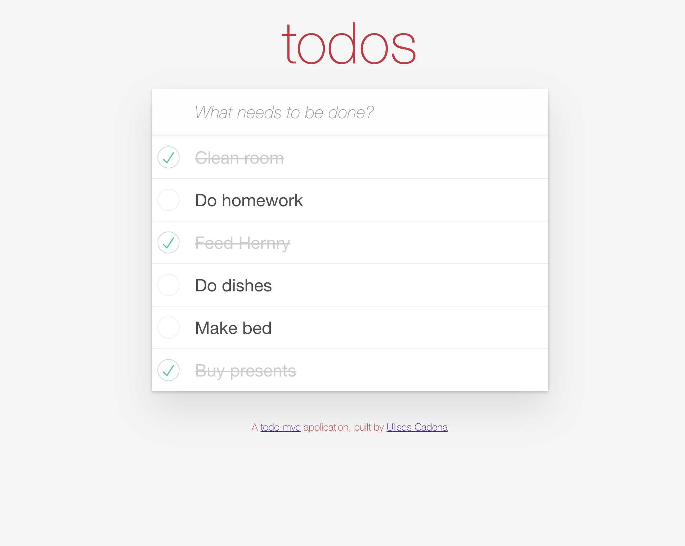

# README

# Single Page Todo Application 

This single-page to-do application features a fluid user interface that– by using JavaScript– allows users to rapidly add dynamic content

Try the app @ https://todov2-ulises-cadena.herokuapp.com/
 

